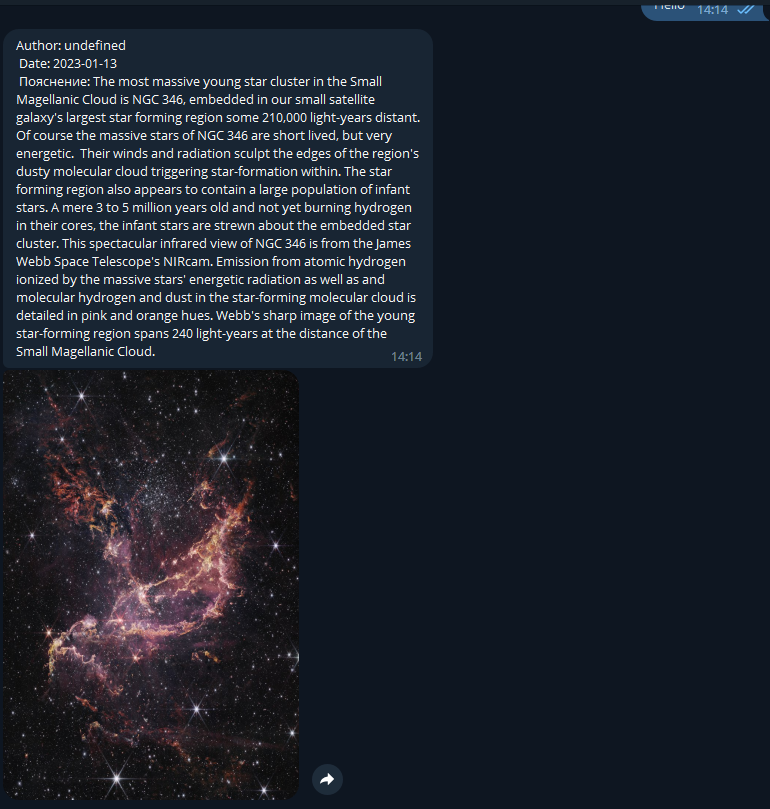

<h3>Telegram бот который работает с NASA API</h3>

### Используемые технологии

1. Node JS server
2. Telegram API with Telegraf library
3. NASA Open API

### Как пользоваться ботом

1. Запустите бота https://t.me/kek_node_bot
2. Напишите ему что-нибудь и он пришлет вам в ответ астрономический факт с изображением.
Каждый день факт и изображение меняются. Просто попробуйте!

### Пример

